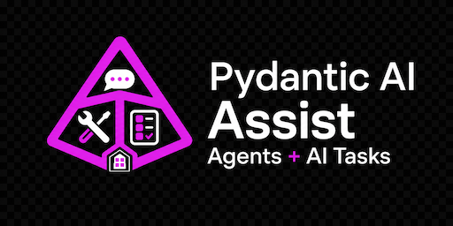

# Pydantic AI Agent

[](https://github.com/bradsjm/hacs-pydantic-ai-agent)

[](https://github.com/hacs/integration)
[](LICENSE)
[](https://opencode.ai/)
[](https://deepwiki.com/bradsjm/hacs-pydantic-ai-agent)

Home Assistant custom integration providing Assist conversation agents and AI task data
generation backed by the [Pydantic AI library](https://pydantic.dev/pydantic-ai) and optional integrated observability via [Logfire](https://logfire.dev/).

## Key Features

- Wizard driven provider and model selection using [models.dev](https://models.dev/)
- Supports custom model providers in addition to models.dev
- Support for multiple workspaces each with its own provider configuration
- Built-in observability via Logfire
- Built-in support for MCP servers (streaming http only to avoid running untrusted code)
  - Parallel execution of MCP requests (disabled by default) for performance
  - Optional deferred tool disclosure (model discovers tools on-demand) to reduce context size
- Support for simple skills (reusable capabilities) library
- Optional web fetch tool with SSRF protection to prevent server-side request forgery attacks
- Support for Home Assistant assist tools for controlling Home Assistant entities

## Installation

This integration requires Home Assistant 2026.5.1 or newer.

### HACS Custom Repository

1. Open HACS in Home Assistant.
2. Go to Integrations, then Custom repositories.
3. Add `https://github.com/bradsjm/hacs-pydantic-ai-agent` as an Integration.
4. Install `Pydantic AI Agent`.
5. Restart Home Assistant.

### Manual

1. Copy `custom_components/pydantic_ai_agent` into your Home Assistant
   `custom_components` directory.
2. Restart Home Assistant.

## Configuration

1. Go to Settings > Devices & services.
2. Add `Pydantic AI Agent`.
3. Create a workspace, then add a provider subentry with its mode and API key.
   Supported modes are OpenAI-compatible Chat Completions,
   OpenAI-compatible Responses, Anthropic, and Google Gemini.
4. Enter a custom base URL when needed. OpenAI-compatible providers default to
   `https://api.openai.com/v1`; Anthropic and Google Gemini use their hosted API
   endpoints when no custom base URL is configured.
5. Add provider, conversation, AI task, and Skill subentries as needed.
6. To expose shared external tools, configure MCP servers in Home Assistant
   Core, expose them through the Home Assistant LLM API you want this
   integration to use, then select that API via `Capabilities`.

Workspace entries own shared Logfire settings. Provider credentials live on
`provider` subentries, while conversation, AI task, and Skill settings remain
on their own subentries. Each provider subentry owns a stable
`model_profiles` map, and conversation/AI task subentries reference profiles
with workspace-local refs shaped like
`<provider_subentry_id>:<model_profile_id>`. Anthropic entries also accept
`anthropic:<model>` identifiers, and Google Gemini entries also accept
`google:<model>` or `google-gla:<model>` identifiers. A prefixed model ID must
match the selected provider mode. Provider credentials are always read from the
provider subentry, not from environment variables.

Model discovery is provider-specific. OpenAI-compatible modes use the
OpenAI-compatible `/models` shape, Anthropic uses Anthropic's model listing API,
and Google Gemini lists Gemini models that support `generateContent`. If model
listing fails or a provider omits a model, the provider flow still accepts
manual model entry and stores the selected provider-owned model profiles without
live model probing.

### Conversation Agents

Add a `Conversation agent` subentry for each Assist agent you want to expose.
Each subentry creates a distinct `conversation.*` entity, and that entity ID is
the Home Assistant conversation agent ID.

Conversation agents support:

- A per-agent name, model, and instruction prompt.
- Optional Home Assistant LLM API selection. Selecting an API enables Home
  Assistant control tools and makes the entity advertise conversation control
  support.
- Optional Web fetch URL content fetching. Web fetch is disabled by default and
  can be enabled independently of Home Assistant control tools.
- Optional workspace Skill selection. Selected Skills are exposed through
  `list_skills` and `load_skill` tools and are not auto-loaded into every
  request.
- Optional model settings including temperature, capability-backed thinking, max
  tokens, max iterations, top P, timeout, parallel tool calls, seed, penalties,
  and extra body fields.
- Optional provider HTTP headers configured on the provider entry and used for
  model discovery and model requests.
- Automatic hidden context trimming for very long conversations. Stored Assist
  history is not pruned; only the model request is windowed.
  When prior model history exceeds 100 messages, the request preserves the first
  message and the latest 50 prior-history messages. Messages from the active
  agent run are always preserved.
- Tool-call follow-up requests preserve provider reasoning metadata such as
  `reasoning` and `reasoning_content` for OpenAI-compatible endpoints that
  require it.
- Plain conversation entities stream Assist responses. Conversations that can
  call tools, including HA LLM APIs, Web fetch, or skills, return
  non-streamed responses so provider tool-result follow-up requests stay on the
  compatibility path.

### AI Tasks

Add an `AI task` subentry for each AI task configuration you want to expose.
Each subentry has its own task name and creates an `ai_task.*` entity that
supports Home Assistant data generation and attachments.

AI task entities can return plain text or validate structured results against
the schema requested by Home Assistant. When Home Assistant requests structured
data, runtime chooses the highest supported strategy in the order `tool`,
`native`, then `prompted` from the resolved model profile capabilities. Each AI
task can also enable Web fetch independently of Home Assistant control tool
selection.
AI task requests use the same automatic model-request context trimming as
conversation agents, including active-run preservation.
AI tasks default to 30 agent request iterations unless the selected language model
profile sets a max iterations override.

### Home Assistant LLM APIs and shared tools

This integration no longer manages its own MCP servers. Shared external tools
must be configured in Home Assistant Core and exposed through a Home Assistant
LLM API.

Recommended setup:

1. Configure any MCP servers in Home Assistant Core `mcp`.
2. Expose those servers through the Home Assistant LLM API you want the model
   to use.
3. In this integration, select that API in the conversation agent or AI task
   `Capabilities` section.

### Skills

Add a `Workspace Skill` subentry for reusable model guidance. The Skill content
field uses Home Assistant's template-style editor for a comfortable multiline
editing experience, but the integration stores and sends the text as raw content;
it is not rendered as a Home Assistant template.

Conversation agents and AI tasks can select Skill subentries from the same
workspace. At runtime, selected Skills are exposed through two Pydantic AI tools:
`list_skills` returns Skill names and descriptions, and `load_skill` returns the
raw content for a selected Skill ID. Skill content is user-managed guidance only;
it cannot override system, Home Assistant, developer, or safety instructions.

Skills do not run scripts, clone repositories, auto-update, or read filesystem
folders. Reference attachments are reserved for a later phase and are redacted in
diagnostics.

### Logfire Tracing

Workspace setup includes optional Logfire tracing fields. Leave the Logfire token
blank to disable Logfire for that workspace. When a token is provided,
the integration adds Home Assistant metadata such as entry, subentry, entity,
model, and conversation IDs to Pydantic AI traces.

The `Include prompt and response content in Logfire` option is disabled by
default. Enable it only if you want Logfire to capture prompt, completion, and
tool payload content. Logfire is configured process-wide in Home Assistant: the
first loaded workspace entry with a token wins, later entries with a different
token are left loaded but get a repair warning and do not emit Logfire traces.

## Development

Use Python 3.14.2 or newer.

Runtime dependencies are declared in both `pyproject.toml` and
`custom_components/pydantic_ai_agent/manifest.json`. The integration uses
`pydantic-ai-slim`, explicit native provider SDK dependencies for Anthropic and
Google Gemini and the in-repo
OpenAI-compatible adapter instead of the OpenAI SDK.

The OpenAI-compatible adapter design is documented in
`docs/openai_compatible_provider_design.md`.

Install or update the development environment, then run the local checks:

```bash
scripts/setup
scripts/check
```
